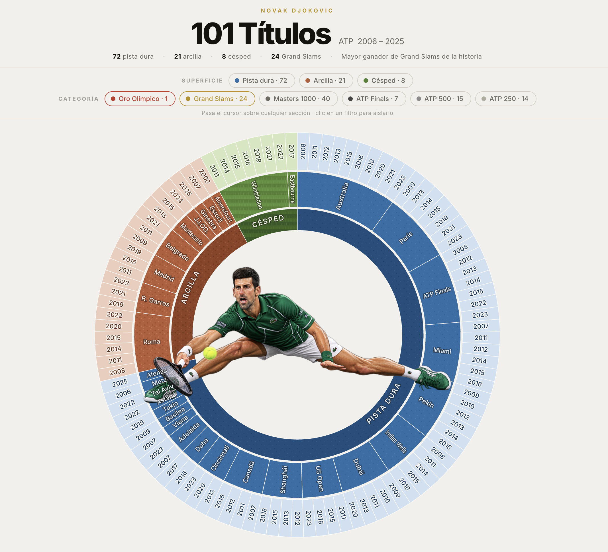

# 🎾 Los 101 títulos de Novak Djokovic

<div align="center">



[](https://SanMabruno.github.io/djokovic-101-titulos/)
[](https://www.atptour.com/en/players/novak-djokovic/d643/titles-and-finals)
[](https://developer.mozilla.org/en-US/docs/Web/HTML)
[](https://developer.mozilla.org/en-US/docs/Web/CSS)
[](https://developer.mozilla.org/en-US/docs/Web/JavaScript)

**Visualización radial interactiva** de los 101 títulos individuales ATP de Novak Djokovic (2006–2025), desglosados por superficie, torneo y año.

</div>

---

## ✨ Características

| Feature | Descripción |
|---|---|
| 🎯 **Hover iluminado** | Al pasar el cursor, solo la sección tocada brilla con efecto glow |
| 🏆 **Filtro Grand Slams** | Botón dedicado para aislar los 24 títulos de Grand Slam |
| 🎨 **Filtro por superficie** | Aísla pista dura, arcilla o césped con un clic |
| 💡 **Tooltip inteligente** | Nombre completo del torneo, año, categoría y total de títulos |
| 🔗 **Fuente verificable** | Enlace directo al perfil oficial de Djokovic en la ATP |
| 📱 **Responsive** | Funciona en desktop y móvil |
| ⚡ **Sin dependencias** | HTML + CSS + JS puro, sin frameworks ni build step |

---

## 🗺️ Estructura de la visualización

Tres anillos concéntricos que cuentan la historia completa:

```
         ┌─────────────────────────────────┐
         │  Anillo EXTERIOR → Año del título │
         │  Anillo MEDIO    → Torneo         │
         │  Anillo INTERIOR → Superficie     │
         └─────────────────────────────────┘
```

- **Interior** — superficie (pista dura 72 · arcilla 21 · césped 8), con textura SVG propia por tipo de cancha.
- **Medio** — torneo, ordenado de mayor a menor número de títulos dentro de cada superficie.
- **Exterior** — el año de cada título individual.

---

## 📊 Los números

| Categoría | Títulos |
|---|---|
| 🟦 Pista dura | 72 |
| 🟫 Arcilla | 21 |
| 🟩 Césped | 8 |
| **Total** | **101** |

| Categoría ATP | Títulos |
|---|---|
| 🏆 Grand Slam | 24 |
| 🥇 Masters 1000 | 40 |
| 🎯 ATP Finals | 7 |
| 🎾 ATP 500 | 15 |
| 🎾 ATP 250 | 14 |
| 🥇 Oro olímpico | 1 |

---

## 🚀 Uso

Sin instalación. Clona y abre:

```bash
git clone https://github.com/SanMabruno/djokovic-101-titulos.git
cd djokovic-101-titulos
open index.html   # macOS
# o simplemente arrastra el archivo al navegador
```

---

## 📁 Estructura del proyecto

```
djokovic-101-titulos/
├── index.html          # Estructura HTML
├── css/
│   └── style.css       # Estilos y efectos de iluminación
├── js/
│   ├── data.js         # Datos de los 101 títulos
│   └── main.js         # Renderizado SVG e interacción
├── assets/
│   └── djokovic.png    # Imagen central del chart
└── README.md
```

---

## 🧰 Stack técnico

El SVG se genera **en tiempo de ejecución** desde el array de datos en `js/data.js`. Las texturas de cancha son `<pattern>` SVG nativos. El efecto de iluminación usa `filter: brightness() drop-shadow()` en CSS.

- **Sin dependencias** — cero npm, cero bundler
- **Un solo punto de verdad** — los datos están en `js/data.js`, fácil de actualizar
- **SVG puro** — escala perfecto a cualquier tamaño

---

## 📎 Fuente de datos

**[ATP Tour — Títulos y finales de Novak Djokovic](https://www.atptour.com/en/players/novak-djokovic/d643/titles-and-finals)**

Títulos individuales a nivel ATP Tour. Incluye el oro olímpico de París 2024. Doha figura como ATP 250 porque esa era su categoría en 2016–2017.

---

## 👤 Autor

**Bruno San Martín Navarro**  
Científico de datos & ingeniero en informática

[](https://www.linkedin.com/in/sanmabruno/)
[](https://github.com/SanMabruno)

---

<div align="center">
<sub>Hecho con SVG puro, curiosidad estadística y mucho respeto por el mejor de todos los tiempos.</sub>
</div>
